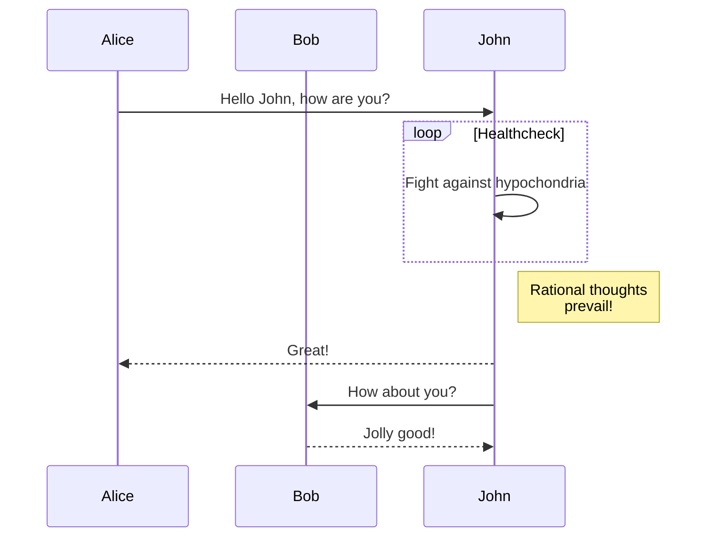
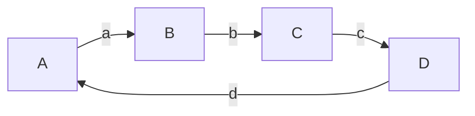

## Why Jekyll with GitBook

GitBook is an amazing frontend style to present and organize contents (such as book chapters
and blogs) on Web. The typical to deploy GitBook at [Github Pages][1]
is building HTML files locally and then push to Github repository, usually to the `gh-pages`
branch. It's quite annoying to repeat such workload and make it hard for people do version
control via git for when there are generated HTML files to be staged in and out.

This theme takes style definition out of generated GitBook site and provided the template
for Jekyll to rendering markdown documents to HTML, thus the whole site can be deployed
to [Github Pages][1] without generating and uploading HTML bundle every time when there are
changes to the original repo.

## How to Get Started

This theme can be used just as other [Jekyll themes][1] and support [remote theme][12],
see [the official guide][13] as well.

You can introduce this jekyll theme into your own site by either

- [Fork][3] this repository and add your markdown posts to the `_posts` folder.
- Use as a remote theme in your [`_config.yml`][14](just like what we do for this
  site itself),

```yaml
remote_theme: sighingnow/jekyll-gitbook
```

### Deploy Locally with Jekyll Serve

This theme can be ran locally using Ruby and Gemfiles.

[Testing your GitHub Pages site locally with Jekyll](https://docs.github.com/en/pages/setting-up-a-github-pages-site-with-jekyll/testing-your-github-pages-site-locally-with-jekyll) - GitHub

## Full-text search

The search functionality in jekyll-gitbook theme is powered by the [gitbook-plugin-search-pro][5] plugin and is enabled by default.

[https://sighingnow.github.io/jekyll-gitbook/?q=generated](https://sighingnow.github.io/jekyll-gitbook/?q=generated)

## Code highlight

The code highlight style is configurable the following entry in `_config.yaml`:

```yaml
syntax_highlighter_style: colorful
```

The default code highlight style is `colorful`, the full supported styles can be found from [the rouge repository][6]. Customized
style can be added to [./assets/gitbook/rouge/](./assets/gitbook/rouge/).

## How to generate TOC

The jekyll-gitbook theme leverages [jekyll-toc][4] to generate the *Contents* for the page.
The TOC feature is not enabled by default. To use the TOC feature, modify the TOC
configuration in `_config.yml`:

```yaml
toc:
    enabled: true
    h_min: 1
    h_max: 3
```

## Google Analytics, etc.

The jekyll-gitboook theme supports embedding the [Google Analytics][7], [CNZZ][8] and [Application Insights][9] website analytical tools with the following
minimal configuration in `_config.yaml`:

```yaml
tracker:
  google_analytics: "<YOUR GOOGLE ANALYTICS KEY, e.g, UA-xxxxxx-x>"
```

Similarly, CNZZ can be added with the following configuration in `_config.yaml`

```yaml
tracker:
  cnzz: "<YOUR CNZZ ANALYTICS KEY, e.g., xxxxxxxx>"
```

Application Insights can be added with the following configuration in `_config.yaml`

```yaml
tracker:
  application_insights: "<YOUR APPLICATION INSIGHTS CONNECTION STRING>"
```

## Disqus comments

[Disqus](https://disqus.com/) comments can be enabled by adding the following configuration in `_config.yaml`:

```yaml
disqushandler: "<YOUR DISQUS SHORTNAME>"
```

## Extra StyleSheet or Javascript elements

You can add extra CSS or JavaScript references using configuration collections:

- extra_css: for additional style sheets. If the url does not start by http, the path must be relative to the root of the site, without a starting `/`.
- extra_header_js: for additional scripts to be included in the `<head>` tag, after the `extra_css` has been added. If the url does not start by http, the path must be relative to the root of the site, without a starting `/`.
- extra_footer_js: for additional scripts to be included at the end of the HTML document, just before the site tracking script. If the url does not start by http, the path must be relative to the root of the site, without a starting `/`.

## Customizing font settings

The fonts can be customized by modifying the `.book.font-family-0` and `.book.font-family-1` entry in [`./assets/gitbook/custom.css`][10],

```css
.book.font-family-0 {
    font-family: Georgia, serif;
}
.book.font-family-1 {
    font-family: "Helvetica Neue", Helvetica, Arial, sans-serif;
}
```

## Tips, Warnings and Dangers blocks

The jekyll-gitbook theme supports customized kramdown attributes (`{: .block-tip }`, `{: .block-warning }`,
`{: .block-danger }`) like that displayed in [the discord.js website][11]. The marker can be used like

```markdown
> ##### TIP
>
> This guide is last tested with @napi-rs/canvas^0.1.20, so make sure you have
> this or a similar version after installation.
{: .block-tip }
```

Rendered page can be previewed from

[https://sighingnow.github.io/jekyll-gitbook/jekyll/2022-06-30-tips_warnings_dangers.html](https://sighingnow.github.io/jekyll-gitbook/jekyll/2022-06-30-tips_warnings_dangers.html)

## Cover image inside pages

The jekyll-gitbook theme supports adding a cover image to a specific page by adding
a `cover` field to the page metadata:

```diff
  ---
  title: Page with cover image
  author: Tao He
  date: 2022-05-24
  category: Jekyll
  layout: post
+ cover: /assets/jekyll-gitbook/dinosaur.gif
  ---
```

The effect can be previewed from

[https://sighingnow.github.io/jekyll-gitbook/jekyll/2022-05-24-page_cover.html](https://sighingnow.github.io/jekyll-gitbook/jekyll/2022-05-24-page_cover.html)

## Diagrams with mermaid.js

This jekyll-theme supports [mermaid.js](https://mermaid.js.org/) to render diagrams
in markdown.

To enable the mermaid support, you need to set `mermaid: true` in the front matter
of your post.

```markdown
---
mermaid: true
---
```

The example can be previewed from

[https://sighingnow.github.io/jekyll-gitbook/jekyll/2023-08-31-mermaid.html](https://sighingnow.github.io/jekyll-gitbook/jekyll/2023-08-31-mermaid.html)

## License

This work is open sourced under the Apache License, Version 2.0.

Copyright 2019 Tao He.


GitBook is an amazing frontend style to present and organize contents (such as book chapters
and blogs) on Web. The typical to deploy GitBook at [Github Pages][15]
is building HTML files locally and then push to Github repository, usually to the `gh-pages`
branch. However, it's quite annoying to repeat such workload and make it hard for people do
version control via git for when there are generated HTML files to be staged in and out.

This theme takes style definition out of generated GitBook site and provided the template
for Jekyll to rendering markdown documents to HTML, thus the whole site can be deployed
to [Github Pages][15] without generating and uploading HTML bundle every time when there are
changes to the original repository.


This jekyll-theme supports [mermaid.js](https://mermaid.js.org/) to render diagrams
in markdown.

To enable the mermaid support, you need to set `mermaid: true` in the front matter
of your post.

```markdown
---
title: Diagrams with mermaid.js
date: 2023-08-31
layout: post
mermaid: true
---
```

Then you can use mermaid syntax in your markdown:

```
graph TD;
    A-->B;
    A-->C;
    B-->D;
    C-->D;
```


Or, even some complex examples:

```
sequenceDiagram
    participant Alice
    participant Bob
    Alice->>John: Hello John, how are you?
    loop Healthcheck
        John->>John: Fight against hypochondria
    end
    Note right of John: Rational thoughts <br/>prevail!
    John-->>Alice: Great!
    John->>Bob: How about you?
    Bob-->>John: Jolly good!
```



Refer to the [mermaid.js website](https://mermaid.js.org/intro/) for more examples.


This jekyll-theme supports tips, warnings, and dangers blocks and the style is referred
from [the discord.js website][16].

You could have the following [markdown attributes (supported by kramdown)][17]:

### Tips

Using a `{: .block-tip}` attribute:

```markdown
> ##### TIP
>
> This guide is last tested with @napi-rs/canvas^0.1.20, so make sure you have
> this or a similar version after installation.
{: .block-tip }
```

> ##### TIP
>
> This guide is last tested with @napi-rs/canvas^0.1.20, so make sure you have
> this or a similar version after installation.
{: .block-tip }

### Warnings

Using a `{: .block-warning}` attribute:

```markdown
> ##### WARNING
>
> Be sure that you're familiar with things like async/await and object destructuring
> before continuing, as we'll be making use of features like these.
{: .block-warning }
```

> ##### WARNING
>
> Be sure that you're familiar with things like async/await and object destructuring
> before continuing, as we'll be making use of features like these.
{: .block-warning }

### Dangers

Using a `{: .block-danger}` attribute:

```markdown
> ##### DANGER
>
> You cannot delete an ephemeral message.
{: .block-danger }
```

> ##### DANGER
>
> You cannot delete an ephemeral message.
{: .block-danger }


#### wide table

A wide tables needs to be wrapped into a `div` with class `table-wrapper`
to make sure it displayed as expected on mobile devices. For example,

```markdown
<div class="table-wrapper" markdown="block">

|title1|title2|title3|title4|title5|title6|title7|title8|
|:-:|:-:|:-:|:-:|:-:|:-:|:-:|:-:|
|1|2|3|4|5|6|7|8|
|1|2|3|4|5|6|7|8|
|1|2|3|4|5|6|7|8|
|1|2|3|4|5|6|7|8|

</div>
```

Will be rendered as

<div class="table-wrapper" markdown="block">

|title1|title2|title3|title4|title5|title6|title7|title8|
|:-:|:-:|:-:|:-:|:-:|:-:|:-:|:-:|
|1|2|3|4|5|6|7|8|
|1|2|3|4|5|6|7|8|
|1|2|3|4|5|6|7|8|
|1|2|3|4|5|6|7|8|

</div>


```yaml
---
title: Page with cover image
author: Tao He
date: 2022-05-24
category: Jekyll
layout: post
cover: https://sighingnow.github.io/jekyll-gitbook/assets/dinosaur.gif
---
```
The jekyll-gitbook theme supports adding a cover image to a specific page by adding
a `cover` field to the page metadata:

```diff
  ---
  title: Page with cover image
  author: Tao He
  date: 2022-05-24
  category: Jekyll
  layout: post
+ cover: /assets/jekyll-gitbook/dinosaur.gif
  ---
```

### How to Generate TOC

The jekyll-gitbook theme leverages [jekyll-toc][18] to generate the *Contents* for the page.
The TOC feature is not enabled by default. To use the TOC feature, modify the TOC
configuration in `_config.yml`:


```python
import numpy as np
x = np.arange(16).reshape(4, 4)
print(x)
```

```yaml
toc:
    enabled: true
```

Why this repo
-------------

long contents .....

1. a
2. b
3. c
4. d

### Sub title 1

### Sub title 2

### Sub title 3

Why this repo
-------------

long contents .....

+ 1
+ 2
+ 3
+ 4

Why this repo
-------------

long contents .....

1. e
2. f
3. g
4. h

Why this repo
-------------

+ 5
+ 6
+ 7
+ 8

Why this repo
-------------

long contents .....

1. a
2. b
3. c
4. d

Why this repo
-------------

long contents .....

+ 1
+ 2
+ 3
+ 4

Why this repo
-------------

long contents .....

1. e
2. f
3. g
4. h

Why this repo
-------------

+ 5
+ 6
+ 7
+ 8

Why this repo
-------------

long contents .....

1. a
2. b
3. c
4. d

Why this repo
-------------

long contents .....

+ 1
+ 2
+ 3
+ 4

Why this repo
-------------

long contents .....

1. e
2. f
3. g
4. h

Why this repo
-------------

+ 5
+ 6
+ 7
+ 8

Why this repo
-------------

long contents .....

1. a
2. b
3. c
4. d

Why this repo
-------------

long contents .....

+ 1
+ 2
+ 3
+ 4

Why this repo
-------------

long contents .....

1. e
2. f
3. g
4. h

Why this repo
-------------

+ 5
+ 6
+ 7
+ 8


### How to Get Started

The jekyll-gitbook theme can be used just as other [Jekyll themes][21] and
support [remote theme][20] on [Github Pages][19], see [the official guide][22]
as well.

You can introduce this jekyll theme into your own site by either

- [Fork][23] this repository and add your markdown posts to the `_posts` folder, then
  push to your own Github repository.
- Use as a remote theme in your [`_config.yml`][24](just like what we do for this
  site itself),

```yaml
# Configurations
title:            Jekyll Gitbook
longtitle:        Jekyll Gitbook

remote_theme:     sighingnow/jekyll-gitbook
```

> ##### TIP
>
> No need to push generated HTML bundle.
{: .block-tip }





This



$$
x^2 + 2 = 3
$$

```python
import numpy as np
print(np.pi)
```

[1]: https://pages.github.com
[2]: https://pages.github.com/themes
[3]: https://github.com/sighingnow/jekyll-gitbook/fork
[4]: https://github.com/allejo/jekyll-toc
[5]: https://github.com/gitbook-plugins/gitbook-plugin-search-pro
[6]: https://github.com/rouge-ruby/rouge/tree/master/lib/rouge/themes
[7]: https://analytics.google.com/analytics/web/
[8]: https://www.cnzz.com/
[9]: https://docs.microsoft.com/en-us/azure/azure-monitor/app/app-insights-overview
[10]: https://github.com/sighingnow/jekyll-gitbook/blob/master/gitbook/custom.css
[11]: https://discordjs.guide/popular-topics/canvas.html#setting-up-napi-rs-canvas
[12]: https://rubygems.org/gems/jekyll-remote-theme
[13]: https://docs.github.com/en/pages/setting-up-a-github-pages-site-with-jekyll/adding-a-theme-to-your-github-pages-site-using-jekyll
[14]: https://github.com/sighingnow/jekyll-gitbook/blob/master/_config.yml
[15]: https://pages.github.com
[16]: https://discordjs.guide/popular-topics/canvas.html#setting-up-napi-rs-canvas
[17]: https://kramdown.gettalong.org/quickref.html#block-attributes
[18]: https://github.com/allejo/jekyll-toc

[19]: https://pages.github.com
[20]: https://github.com/sighingnow/jekyll-gitbook/fork
[21]: https://pages.github.com/themes
[22]: https://docs.github.com/en/pages/setting-up-a-github-pages-site-with-jekyll/adding-a-theme-to-your-github-pages-site-using-jekyll
[23]: https://github.com/sighingnow/jekyll-gitbook/fork
[24]: https://github.com/sighingnow/jekyll-gitbook/blob/master/_config.yml

This work is open sourced under the Apache License, Version 2.0, using the
same license as the original [GitBook](https://github.com/GitbookIO/gitbook) repository.

Copyright 2019 Tao He.
