This module follows from Module 1.1 and 1.2 after which the cohort consists of only Technical Managers or Techincal Developers are part of the cohort therefore it needs to introduce the ideas of Quantum Computing in a slightly more technical fashion than previous modules however we cannot employ a fully mathematical method to descirbe Quantum Mechanics and therefore we employ Phenomonological tools and experiments to start developing an intuition, we will try to introduce through the route of Classical computing and Bits and introduce concepts and features of Quantum Computing in contrast to their Classical Analogues. We also want to give the audience a basic introuction to Quantum gates and understand some basic Qubit manipulation property.

In this module we revise the good old and simpler concepts of bits and their manipulations to set the stage for the fundamental blocks of quantum computing, i.e., qubits and their manipulation. As we go through the sections below, we will -

- Learn the features of bits and qubits from phenomenological perspective, and through comparison of their similarities and differences.
- We will also learn how manipulating bits and a qubits forms a building block for basic computations.

- In this lecture, we aim to introduce the topics of Quantum computing importantly Qubits we aim to do this by first establishing and the ideas of Bits in Classical Computing and contrast compare the features between Bits and Qubits. Both Bits and Qubits are the fundamental building blocks of classical and quantum computing, respectively. We will not be employing a very rigorous mathematical process as part of the lectures. We will look at it more from a phenomenological perspective. That is how these act under certain circumstances. And what we can do with them. These lecture notes aim to provide some more mathematical and conceptual depth to increase supplement the content within the lectures.

- Every Module starts with a discussion as to where the material within the module fits in the Quantum Stack in the case of this introductory module the concepts of Quantum Mechanics and Information are present at almost every level of the stack, The Application  and Algorithms layer use certain Quantum Phenomenon to solve real-life use cases, the software layer provides a route to interact with the Computing Hardware and the Hardware layer naturally uses principle of Quantum Mechanics and Inforamtion in it's operation)

```mermaid 
graph TD;
A(146) --"÷10"--> B(14);
B --"÷10"--> C(1);
C --"÷10"--> D(0);
Remainder --> 6 --> 4 --> 1;
A --"r"--> 6;
```

  

  

